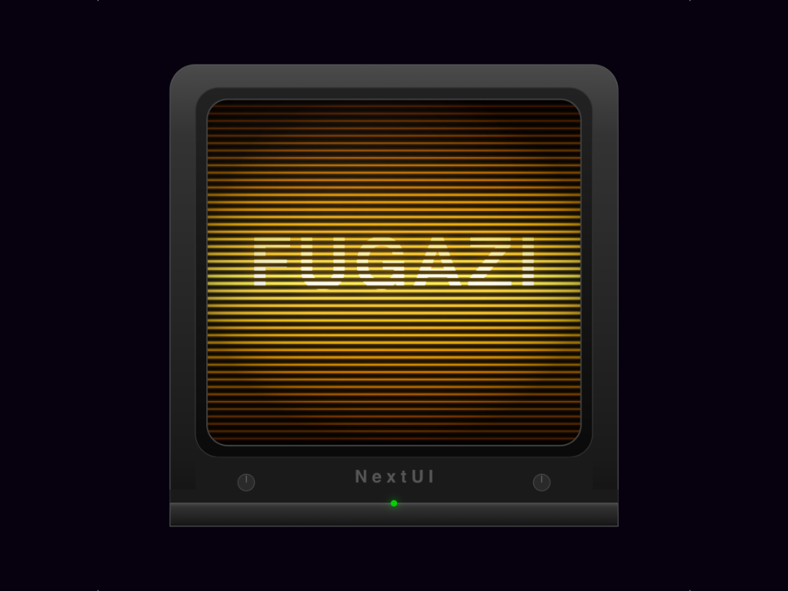

<div align="center">

# Fugazi



[](https://github.com/ericreinsmidt/nextui-fugazi/releases)
[](https://github.com/ericreinsmidt/nextui-fugazi/releases)
[](LICENSE)

A CRT shader tweaker with live preview for [NextUI](https://github.com/LoveRetro/NextUI) on TrimUI handheld devices.

Built with [PakKit](https://github.com/ericreinsmidt/pakkit) and [Apostrophe](https://github.com/Helaas/Apostrophe).

</div>

## Features

- **Live shader preview** — Full-screen game screenshot rendered through the shader in real-time as you adjust parameters
- **8 tunable parameters** — Curvature, glow, scanlines, gap darkness, phosphor mask, vignette, brightness, warmth
- **One-button install** — Writes shader directly to system for immediate in-game use
- **Clear to passthrough** — Reset all effects to zero with a single button press
- **Loads installed settings** — On launch, shows what's currently active in-game
- **Brightness-adaptive scanlines** — Bright pixels bloom wider, dark pixels stay sharp (like a real CRT beam)
- **RGB phosphor mask** — Simulates subpixel stripe pattern that fades on dark areas
- **Minimal UI** — Full-screen preview with a semi-transparent bottom bar
- **Optimized for Mali-G31** — No trig, no pow/exp, branchless math, 2-pass pipeline

## How It Works

Fugazi is a 2-pass GLSL shader designed for minarch (NextUI's emulator runtime):

1. **Pass 1 — Glow:** Barrel distortion + 5-tap cross blur for soft phosphor bloom
2. **Pass 2 — Scanlines:** Brightness-adaptive scanlines, RGB phosphor mask, vignette, color warmth, brightness compensation

The app lets you adjust all parameters with a live preview, then install the result as a system shader that any game can use.

## Controls

| Button | Action |
|--------|--------|
| Up/Down | Cycle through parameters |
| Left/Right | Adjust value |
| A | Install shader to system |
| Y | Clear all effects (passthrough) |
| B | Quit |

## Parameters

| Parameter | Description | Range |
|-----------|-------------|-------|
| Curvature | Screen edge bend | 0.00 – 0.25 |
| Glow | Soft light bleed | 0.00 – 0.80 |
| Scanlines | Dark line strength | 0.00 – 1.00 |
| Gap Darkness | How dark between lines | 0.00 – 0.50 |
| Phosphor Mask | Vertical color stripes | 0.00 – 0.60 |
| Vignette | Dark corners | 0.00 – 0.70 |
| Brightness | Compensate for darkening | 0.50 – 2.50 |
| Warmth | Warm color shift | 0.00 – 0.30 |

## Installation

1. Download `Fugazi.tg5040.pak.zip` from the [latest release](https://github.com/ericreinsmidt/nextui-fugazi/releases/latest)
2. Extract and copy the `Fugazi.pak` folder to `Tools/tg5040/` on your SD card
3. Launch from the Tools menu in NextUI

### Using the Shader In-Game

After installing from the app:
1. Launch any game in NextUI
2. Open the in-game menu
3. Go to Shader settings and select **fugazi**

## Supported Devices

- TrimUI Brick
- TrimUI Brick Hammer
- TrimUI Smart Pro

## Building

Requires Docker and the NextUI tg5040 toolchain image.

```sh
make build      # Cross-compile via Docker
make package    # Build + create distribution zip
make clean      # Remove build artifacts
```

## Device Paths

| Path | Description |
|------|-------------|
| /mnt/SDCARD/Tools/tg5040/Fugazi.pak/ | App installation |
| /mnt/SDCARD/Shaders/fugazi.cfg | Installed shader config |
| /mnt/SDCARD/Shaders/glsl/fugazi-glow.glsl | Installed pass 1 shader |
| /mnt/SDCARD/Shaders/glsl/fugazi-scanline.glsl | Installed pass 2 shader |
| /mnt/SDCARD/.shadercache/fugazi-*.glsl.bin | Compiled shader cache (cleared on install) |

## Credits

- **Fugazi** by Eric Reinsmidt
- **[PakKit](https://github.com/ericreinsmidt/pakkit)** UI components by Eric Reinsmidt
- **[Apostrophe](https://github.com/Helaas/Apostrophe)** UI toolkit by [Helaas](https://github.com/Helaas)
- **[NextUI](https://github.com/LoveRetro/NextUI)** by [LoveRetro](https://github.com/LoveRetro)

## License

MIT -- see [LICENSE](LICENSE) for details.
